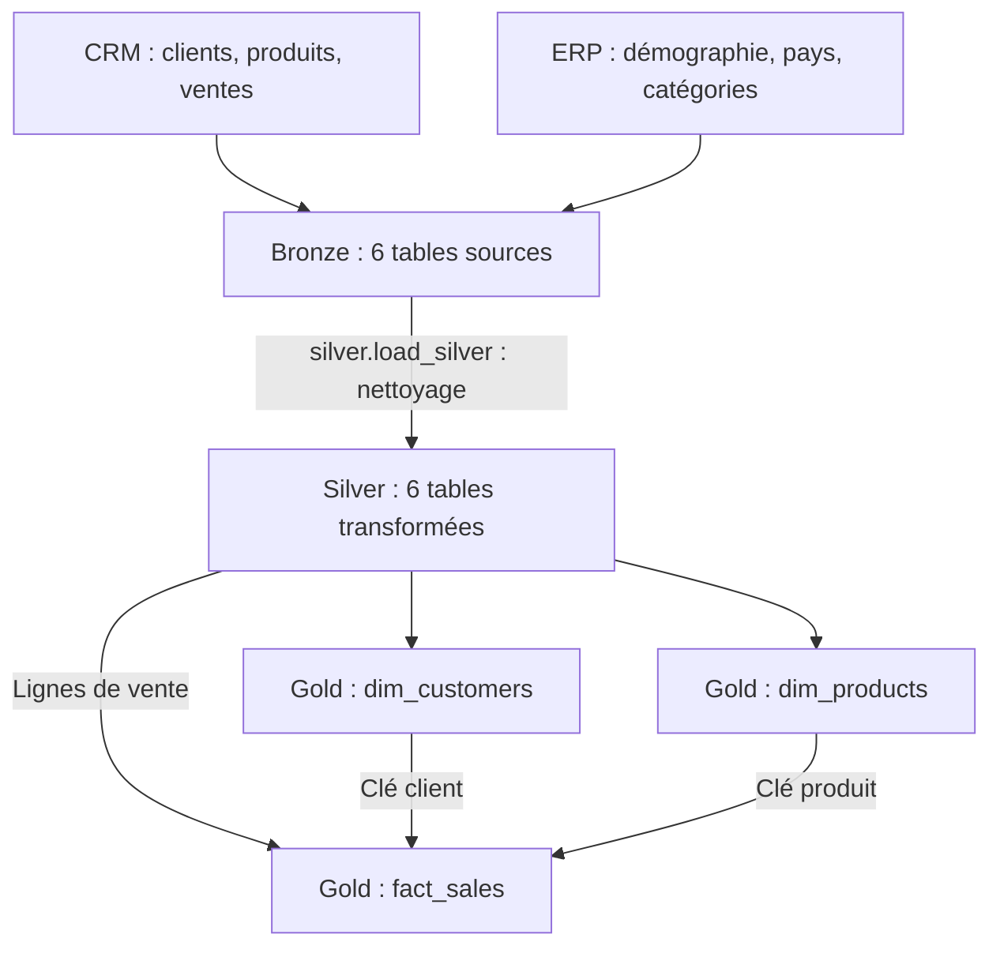
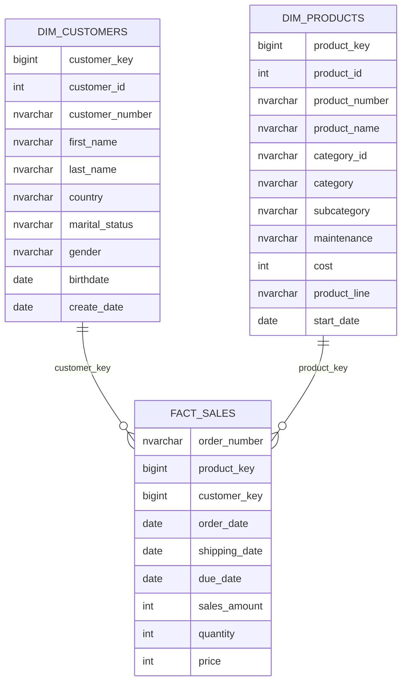

# Data Warehouse SQL Server — Données clients, produits et ventes

Un entrepôt de données construit en **SQL / T-SQL** pour centraliser six fichiers issus de deux systèmes, **CRM et ERP**, nettoyer leurs données et les rendre exploitables pour l'analyse des ventes.

Le projet suit une architecture **Bronze → Silver → Gold** : les données sont d'abord importées, puis fiabilisées, avant d'être organisées en **modèle en étoile** autour des ventes, des clients et des produits.

| Sources | Volume des ventes | Traitement | Restitution |
| --- | --- | --- | --- |
| 6 fichiers CSV, répartis entre CRM et ERP | 60 398 lignes de vente | 2 procédures stockées ; 6 tables Bronze et 6 tables Silver | 2 dimensions et 1 vue de faits |

## Sommaire

- [Objectif du projet](#objectif-du-projet)
- [Architecture générale](#architecture-générale)
- [Sources de données](#sources-de-données)
- [Fichiers du projet](#fichiers-du-projet)
- [Transformations et règles de gestion](#transformations-et-règles-de-gestion)
- [Relations entre les données](#relations-entre-les-données)
- [Modèle en étoile](#modèle-en-étoile)
- [Installation et exécution](#installation-et-exécution)
- [Exemples de requêtes analytiques](#exemples-de-requêtes-analytiques)
- [Contrôles après chargement](#contrôles-après-chargement)
- [Périmètre et évolutions possibles](#périmètre-et-évolutions-possibles)

## Objectif du projet

Les informations nécessaires à l'analyse sont réparties entre plusieurs fichiers : le CRM contient les clients, les produits et les ventes, tandis que l'ERP apporte des informations démographiques, géographiques et de classification des produits.

Ces sources ne sont pas directement prêtes à être rapprochées : certains identifiants ont des formats différents, des clients sont présents plusieurs fois, des valeurs sont manquantes et certaines données nécessitent des corrections.

Le pipeline permet de :

- **Centraliser** les données CRM et ERP dans SQL Server.
- **Nettoyer et harmoniser** les valeurs et les identifiants.
- **Relier** chaque vente à un client et à un produit.
- **Exposer** des vues utilisables pour calculer des indicateurs : chiffre d'affaires, quantités vendues, commandes, répartition par pays ou par catégorie.

**Compétences mobilisées :** modélisation dimensionnelle, intégration multisource, procédures stockées, fonctions de fenêtrage (`ROW_NUMBER`, `LEAD`), jointures, transformations SQL et contrôles de qualité.

## Architecture générale



L'import des fichiers CRM et ERP vers Bronze est assuré par `bronze.load_bronze` avec `BULK INSERT`.

| Couche | Rôle | Objets | Mode de traitement |
| --- | --- | --- | --- |
| **Bronze** | Conserver les données sources sans nettoyage métier | 6 tables dans le schéma `bronze` | Vidage des tables puis import des CSV |
| **Silver** | Nettoyer les données et rendre les identifiants compatibles | 6 tables dans le schéma `silver` | Vidage des tables puis insertion des données transformées |
| **Gold** | Organiser les données pour l'analyse | 3 vues dans le schéma `gold` | Lecture des données Silver et jointures à la requête |

> **Fonctionnement :** Bronze et Silver sont rechargées intégralement avec `TRUNCATE TABLE`. Gold contient des **vues SQL**, sans chargement physique distinct. Après une actualisation de Silver, elles lisent les données actualisées.

## Sources de données

Les volumes ci-dessous correspondent aux fichiers CSV fournis, hors ligne d'en-tête, avant nettoyage.

| Système | Fichier | Lignes | Informations principales | Table Bronze correspondante |
| --- | --- | ---: | --- | --- |
| CRM | [cust_info.csv](cust_info.csv) | 18 494 | Identifiant client, nom, prénom, statut marital, genre, date de création | `bronze.crm_cust_info` |
| CRM | [prd_info.csv](prd_info.csv) | 397 | Identifiants produit, nom, coût, gamme, dates des versions | `bronze.crm_prd_info` |
| CRM | [sales_details.csv](sales_details.csv) | 60 398 | Commande, client, produit, dates, montant, quantité, prix | `bronze.crm_sales_details` |
| ERP | [CUST_AZ12.csv](CUST_AZ12.csv) | 18 484 | Identifiant client, date de naissance, genre | `bronze.erp_cust_az12` |
| ERP | [LOC_A101.csv](LOC_A101.csv) | 18 484 | Identifiant client, pays | `bronze.erp_loc_a101` |
| ERP | [PX_CAT_G1V2.csv](PX_CAT_G1V2.csv) | 37 | Identifiant de catégorie, catégorie, sous-catégorie, maintenance | `bronze.erp_px_cat_g1v2` |

Les tables Silver reprennent ces six noms avec le préfixe `silver.`. Elles ajoutent un champ `dwh_create_date`, renseigné par défaut lors de l'insertion, pour tracer la date de chargement.

**À distinguer :** les 60 398 lignes de vente correspondent à **27 659 numéros de commande distincts** dans le fichier source. Une commande peut contenir plusieurs produits.

## Fichiers du projet

Les liens de ce README supposent que les scripts et les CSV sont placés à la racine du dépôt, à côté de `README.md`.

| Fichier | Fonction | Dépendance principale |
| --- | --- | --- |
| [ddl_bronze.sql](ddl_bronze.sql) | Crée les six tables Bronze | Schéma `bronze` existant |
| [proc_load_bronze.sql](proc_load_bronze.sql) | Définit `bronze.load_bronze` : import des six CSV | Tables Bronze et chemins des CSV configurés |
| [ddl_silver.sql](ddl_silver.sql) | Crée les six tables Silver | Schéma `silver` existant |
| [proc_load_silver.sql](proc_load_silver.sql) | Définit `silver.load_silver` : nettoyage et transformation | Tables Bronze et Silver |
| [ddl_gold.sql](ddl_gold.sql) | Crée les dimensions clients/produits puis la vue de faits | Tables Silver et schéma `gold` existants |

**DDL** signifie *Data Definition Language* : ces scripts définissent les objets de la base. Les fichiers `proc_load_*.sql` définissent les procédures ; le chargement est déclenché ensuite avec `EXEC`.

## Transformations et règles de gestion

### Bronze — Importer les sources

La procédure `bronze.load_bronze` vide chaque table puis importe le CSV correspondant avec `BULK INSERT` :

- `FIRSTROW = 2` ignore l'en-tête.
- `FIELDTERMINATOR = ','` définit le séparateur de champs.
- `TABLOCK` demande un verrou au niveau de la table pendant l'import.

Les colonnes sont typées dès Bronze : par exemple, les dates de vente sont initialement stockées en `INT`, alors que les dates de naissance sont déjà stockées en `DATE`.

### Silver — Nettoyer et harmoniser

| Table Silver | Transformations implémentées | Utilité |
| --- | --- | --- |
| `crm_cust_info` | Exclusion des identifiants `NULL` ; conservation de l'enregistrement le plus récent par `cst_id` avec `ROW_NUMBER` ; suppression des espaces en début/fin de nom ; normalisation du statut marital et du genre | Obtenir une ligne par identifiant client et des libellés homogènes |
| `crm_prd_info` | Séparation de la catégorie et de la référence produit ; remplacement des coûts `NULL` par `0` ; traduction des codes de gamme ; recalcul des dates de fin avec `LEAD` | Relier les produits aux catégories ERP et distinguer leurs versions |
| `crm_sales_details` | Conversion des dates numériques en `DATE` ; remplacement par `NULL` des dates égales à zéro ou de longueur différente de huit ; règles de recalcul des montants et des prix | Préparer les mesures et les dates de vente pour l'analyse |
| `erp_cust_az12` | Suppression du préfixe `NAS` lorsqu'il existe ; remplacement des dates de naissance futures par `NULL` ; normalisation du genre | Rapprocher les clients ERP du CRM et fiabiliser leurs attributs |
| `erp_loc_a101` | Suppression des tirets de l'identifiant ; harmonisation de `DE`, `US` et `USA` ; remplacement des pays vides ou `NULL` par `n/a` | Rendre les clés clients compatibles et homogénéiser les pays |
| `erp_px_cat_g1v2` | Reprise des quatre colonnes sources sans transformation métier supplémentaire | Fournir le référentiel de catégories pour les produits |

**Exemple de dédoublonnage client :** les 18 494 lignes du CSV comprennent 4 lignes sans identifiant et 6 occurrences supplémentaires d'identifiants déjà présents. La règle du script conduit à conserver 18 484 identifiants clients distincts. Si plusieurs lignes d'un même client ont la même date maximale, le script ne définit pas de critère supplémentaire pour les départager.

**Versions produit :** pour chaque `prd_key` source, la date de fin d'une version devient la date de début de la version suivante moins un jour. La dernière version conserve une date de fin `NULL`.

**Montants des ventes :**

- Si le montant est `NULL`, inférieur ou égal à zéro, ou différent de `quantité × ABS(prix)`, le script le remplace par `quantité × ABS(prix)`.
- Si le prix est `NULL` ou inférieur ou égal à zéro, le script le remplace par `montant / NULLIF(quantité, 0)`.
- Les deux calculs utilisent les valeurs Bronze d'origine dans le même `SELECT`. Ils ne constituent donc pas une garantie générale de cohérence lorsque plusieurs champs sont simultanément incorrects.

### Gold — Construire les objets analytiques

| Vue | Construction | Règle principale |
| --- | --- | --- |
| `gold.dim_customers` | Clients CRM enrichis avec la démographie et le pays ERP | Le genre CRM est prioritaire ; si sa valeur est `n/a`, le genre ERP est utilisé, puis `n/a` s'il manque |
| `gold.dim_products` | Produits CRM enrichis avec les catégories ERP | Seules les versions dont `prd_end_dt IS NULL` sont conservées |
| `gold.fact_sales` | Lignes de vente Silver reliées aux deux dimensions | Les identifiants métier servent à retrouver les clés `customer_key` et `product_key` |

Les jointures sont des `LEFT JOIN` : l'absence de correspondance ne supprime pas la ligne de gauche. Une vente sans dimension correspondante reste donc présente avec une clé dimensionnelle `NULL`.

## Relations entre les données

### Comment les identifiants deviennent compatibles

| Lien à construire | Exemple avant transformation | Valeur utilisée pour la jointure |
| --- | --- | --- |
| Client CRM → démographie ERP | CRM : `AW00011000` ; ERP : `NASAW00011000` | `AW00011000` après suppression de `NAS` côté ERP |
| Client CRM → pays ERP | CRM : `AW00011000` ; ERP : `AW-00011000` | `AW00011000` après suppression du tiret côté ERP |
| Produit CRM → catégorie ERP | Produit : `CO-RF-FR-R92B-58` | Catégorie extraite : `CO_RF`, compatible avec l'identifiant ERP |
| Vente → produit CRM nettoyé | Clé produit source : `CO-RF-FR-R92B-58` | Référence produit extraite : `FR-R92B-58`, au format des références de vente |

### Conditions exactes des jointures

| Objet construit | Source de gauche | Source de droite | Condition |
| --- | --- | --- | --- |
| `gold.dim_customers` | `silver.crm_cust_info` | `silver.erp_cust_az12` | `cst_key = cid` |
| `gold.dim_customers` | `silver.crm_cust_info` | `silver.erp_loc_a101` | `cst_key = cid` |
| `gold.dim_products` | `silver.crm_prd_info` | `silver.erp_px_cat_g1v2` | `cat_id = id` |
| `gold.fact_sales` | `silver.crm_sales_details` | `gold.dim_customers` | `sls_cust_id = customer_id` |
| `gold.fact_sales` | `silver.crm_sales_details` | `gold.dim_products` | `sls_prd_key = product_number` |

**Deux identifiants clients, deux usages :** `cst_id` est l'identifiant numérique utilisé pour relier les ventes aux clients. `cst_key` est la référence textuelle utilisée pour rapprocher CRM et ERP.

## Modèle en étoile

La vue `fact_sales` est au centre du modèle. Elle contient les mesures, les dates et les clés de rattachement. Les dimensions portent les attributs descriptifs utilisés pour filtrer ou regrouper les ventes.



Les cardinalités représentent le **modèle logique attendu** : un client ou un produit peut être associé à plusieurs lignes de vente. Les vues ne déclarent pas de contraintes physiques de clé primaire ou étrangère ; les correspondances et l'unicité doivent être contrôlées.

- **Grain du fait :** une ligne issue de `silver.crm_sales_details`, enrichie par les dimensions, sous réserve de leur unicité. `order_number` ne constitue pas une clé unique de ligne.
- **Mesures :** `sales_amount` est le montant de la ligne, `quantity` sa quantité et `price` son prix unitaire. Le montant et la quantité peuvent être additionnés ; additionner des prix unitaires ne donne pas un indicateur de ventes.
- **Clés techniques :** `customer_key` et `product_key` sont calculées par `ROW_NUMBER()` dans les vues. Elles ne sont pas stockées durablement et peuvent changer si les données ou leur ordre changent.
- **Historique produit :** Silver conserve les différentes versions du fichier source. Gold retient uniquement la dernière version par clé source ; les ventes historiques ne sont pas jointes à la version valable à leur date de vente.

## Installation et exécution

### 1. Préparer l'environnement

- Disposer d'une instance **SQL Server 2017 ou ultérieure**, notamment pour l'utilisation de `TRIM`.
- Utiliser un client SQL acceptant les séparateurs de lots `GO`, par exemple SQL Server Management Studio.
- Disposer des droits nécessaires pour créer la base, les schémas, les tables, les vues et les procédures, puis importer les fichiers.
- Rendre les six CSV accessibles à SQL Server : `BULK INSERT` lit les chemins du côté du serveur. Un fichier uniquement présent sur le poste client n'est pas nécessairement accessible au serveur.

### 2. Créer la base et les schémas

Les cinq scripts fournis ne créent pas la base ni les schémas. Dans une nouvelle instance de travail, exécuter cette initialisation :

```sql
USE master;
GO

IF DB_ID(N'DataWarehouse') IS NULL
    EXEC(N'CREATE DATABASE DataWarehouse');
GO

USE DataWarehouse;
GO

IF SCHEMA_ID(N'bronze') IS NULL
    EXEC(N'CREATE SCHEMA bronze');
GO

IF SCHEMA_ID(N'silver') IS NULL
    EXEC(N'CREATE SCHEMA silver');
GO

IF SCHEMA_ID(N'gold') IS NULL
    EXEC(N'CREATE SCHEMA gold');
GO
```

Pour chacun des scripts suivants, sélectionner la base `DataWarehouse` dans le client SQL ou exécuter `USE DataWarehouse;` avant le script.

### 3. Configurer les chemins des CSV

Dans [proc_load_bronze.sql](proc_load_bronze.sql), adapter les six chemins `FROM` à l'emplacement réel des fichiers sur le serveur.

Les chemins actuellement présents suivent cette convention :

```text
C:\sql\dwh_project\datasets\source_crm\cust_info.csv
C:\sql\dwh_project\datasets\source_crm\prd_info.csv
C:\sql\dwh_project\datasets\source_crm\sales_details.csv
C:\sql\dwh_project\datasets\source_erp\cust_az12.csv
C:\sql\dwh_project\datasets\source_erp\loc_a101.csv
C:\sql\dwh_project\datasets\source_erp\px_cat_g1v2.csv
```

Les fichiers ERP fournis ont des noms en majuscules (`CUST_AZ12.csv`, `LOC_A101.csv`, `PX_CAT_G1V2.csv`). Adapter aussi la casse dans les chemins si le système de fichiers y est sensible. L'organisation des CSV dans le dépôt est indépendante de leur emplacement d'import sur le serveur.

### 4. Créer les objets et charger les données

| Ordre | Action | Résultat |
| ---: | --- | --- |
| 1 | Exécuter `ddl_bronze.sql` | Création des tables Bronze |
| 2 | Exécuter `ddl_silver.sql` | Création des tables Silver |
| 3 | Exécuter `proc_load_bronze.sql` | Création ou mise à jour de la procédure Bronze |
| 4 | Exécuter `proc_load_silver.sql` | Création ou mise à jour de la procédure Silver |
| 5 | Exécuter `EXEC bronze.load_bronze;` | Import des CSV |
| 6 | Vérifier les messages et les données Bronze, puis exécuter `EXEC silver.load_silver;` | Transformation des données |
| 7 | Vérifier les messages et les données Silver, puis exécuter `ddl_gold.sql` | Création des trois vues analytiques |

> Les scripts DDL Bronze et Silver suppriment puis recréent les tables existantes. Les procédures vident les tables avant chargement. Utiliser une base dédiée à ce projet et contrôler les messages avant de passer à la couche suivante.

### 5. Actualiser les données

Après la première installation, si les structures restent identiques, relancer `bronze.load_bronze`, vérifier son chargement, puis relancer `silver.load_silver`. Il n'est pas nécessaire de recréer les vues Gold à chaque actualisation.

Les procédures affichent la durée de chargement par table, la durée totale et les erreurs rencontrées via `TRY...CATCH` et `PRINT`.

## Exemples de requêtes analytiques

### Indicateurs globaux

```sql
SELECT
    SUM(CAST(sales_amount AS BIGINT)) AS total_sales,
    SUM(CAST(quantity AS BIGINT))    AS total_quantity,
    COUNT(DISTINCT order_number)     AS total_orders,
    COUNT(DISTINCT customer_key)     AS purchasing_customers
FROM gold.fact_sales;
```

Le nombre de commandes utilise `COUNT(DISTINCT order_number)` pour ne pas confondre commandes et lignes de vente. `purchasing_customers` compte les clients rattachés à une dimension ; les clés `NULL` ne sont pas comptées.

### Chiffre d'affaires par pays et catégorie

```sql
SELECT
    COALESCE(c.country, 'Unmatched')  AS country,
    COALESCE(p.category, 'Unmatched') AS category,
    SUM(CAST(f.sales_amount AS BIGINT)) AS total_sales,
    SUM(CAST(f.quantity AS BIGINT))     AS total_quantity
FROM gold.fact_sales AS f
LEFT JOIN gold.dim_customers AS c
    ON f.customer_key = c.customer_key
LEFT JOIN gold.dim_products AS p
    ON f.product_key = p.product_key
GROUP BY
    COALESCE(c.country, 'Unmatched'),
    COALESCE(p.category, 'Unmatched')
ORDER BY total_sales DESC;
```

Cette requête combine les ventes du CRM, les pays de l'ERP et les catégories de l'ERP à travers le modèle Gold.

### Évolution mensuelle du chiffre d'affaires

```sql
SELECT
    DATEFROMPARTS(YEAR(order_date), MONTH(order_date), 1) AS sales_month,
    SUM(CAST(sales_amount AS BIGINT)) AS total_sales,
    COUNT(DISTINCT order_number)     AS total_orders
FROM gold.fact_sales
WHERE order_date IS NOT NULL
GROUP BY DATEFROMPARTS(YEAR(order_date), MONTH(order_date), 1)
ORDER BY sales_month;
```

Cette analyse exclut les ventes sans date de commande valide. Leur volume doit être contrôlé séparément.

## Contrôles après chargement

Ces requêtes sont proposées pour valider une exécution locale. Les volumes sources présentés plus haut proviennent de la lecture des CSV ; ils ne constituent pas un compte rendu d'exécution du pipeline sur SQL Server.

<details>
<summary><strong>Afficher les contrôles SQL : volumes, jointures et cohérence des ventes</strong></summary>

### Comparer les volumes

```sql
SELECT 'bronze.crm_cust_info' AS object_name, COUNT_BIG(*) AS row_count
FROM bronze.crm_cust_info
UNION ALL
SELECT 'silver.crm_cust_info', COUNT_BIG(*) FROM silver.crm_cust_info
UNION ALL
SELECT 'gold.dim_customers', COUNT_BIG(*) FROM gold.dim_customers
UNION ALL
SELECT 'bronze.crm_sales_details', COUNT_BIG(*) FROM bronze.crm_sales_details
UNION ALL
SELECT 'silver.crm_sales_details', COUNT_BIG(*) FROM silver.crm_sales_details
UNION ALL
SELECT 'gold.fact_sales', COUNT_BIG(*) FROM gold.fact_sales;
```

Avec les fichiers fournis et un chargement réussi, Bronze doit contenir 18 494 lignes clients et 60 398 lignes de vente. La règle de dédoublonnage doit ramener Silver à 18 484 clients. Une hausse du nombre de lignes entre Silver et Gold peut indiquer une multiplication des lignes par les jointures.

### Détecter des doublons dans les clés de rapprochement Gold

```sql
SELECT customer_id, COUNT(*) AS occurrences
FROM gold.dim_customers
GROUP BY customer_id
HAVING COUNT(*) > 1;

SELECT product_number, COUNT(*) AS occurrences
FROM gold.dim_products
GROUP BY product_number
HAVING COUNT(*) > 1;
```

Ces requêtes doivent retourner zéro ligne pour préserver le grain attendu des ventes lors des jointures.

### Repérer les ventes sans correspondance et les valeurs à vérifier

```sql
SELECT
    COUNT_BIG(*) AS sales_rows,
    SUM(CASE WHEN customer_key IS NULL THEN 1 ELSE 0 END) AS unmatched_customers,
    SUM(CASE WHEN product_key IS NULL THEN 1 ELSE 0 END)  AS unmatched_products,
    SUM(CASE WHEN order_date IS NULL THEN 1 ELSE 0 END)   AS missing_order_dates
FROM gold.fact_sales;

SELECT *
FROM gold.fact_sales
WHERE sales_amount IS NULL
   OR quantity IS NULL
   OR price IS NULL
   OR quantity <= 0
   OR price < 0
   OR sales_amount < 0
   OR CAST(sales_amount AS BIGINT) <> CAST(quantity AS BIGINT) * price
   OR shipping_date < order_date
   OR due_date < order_date;
```

Les lignes retournées sont à examiner : les transformations implémentées ne remplacent pas ces contrôles.

</details>

## Périmètre et évolutions possibles

Le projet couvre l'import de fichiers, le nettoyage SQL, l'intégration CRM/ERP et la construction d'un modèle analytique. Les scripts fournis peuvent servir de base à des requêtes de reporting ; ils n'incluent pas de tableau de bord ni d'ordonnanceur.

| État actuel | Évolution possible |
| --- | --- |
| Rechargement complet de Bronze et Silver | Ajouter un chargement incrémental si les volumes ou la fréquence l'exigent |
| Clés Gold calculées avec `ROW_NUMBER()` | Matérialiser les dimensions avec des clés persistantes pour des chargements incrémentaux |
| Produits Gold limités à la dernière version | Ajouter une jointure temporelle pour analyser les ventes avec les attributs produit valables au moment de la vente |
| Messages de suivi avec `PRINT` ; erreurs interceptées sans `THROW` ; absence de transaction globale | Persister les journaux, propager les erreurs et définir une stratégie de reprise après chargement partiel |
| Dates de vente contrôlées sur la longueur puis converties avec `CAST` | Utiliser `TRY_CONVERT` et une table de rejets pour traiter aussi les dates à huit chiffres impossibles |
| Montants, prix et coûts stockés en `INT` ; division entière possible lors du recalcul du prix | Utiliser `DECIMAL` pour gérer les centimes et préciser les règles de correction des valeurs manquantes |
| Contrôles SQL manuels proposés dans ce README | Automatiser les contrôles d'unicité, de correspondance, de volumes et de cohérence avant consommation des vues |

